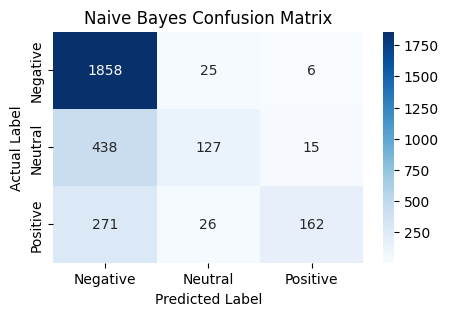
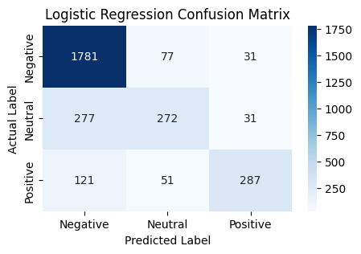
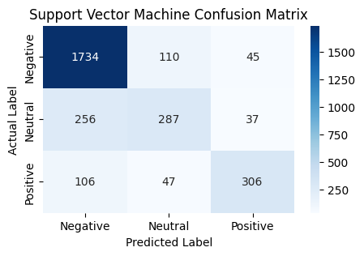

# Twitter Sentiment Analysis using NLP and Machine Learning

## 📌 Project Overview
This project performs Sentiment Analysis on Twitter data to classify tweets as **Positive, Negative, or Neutral**. It demonstrates a complete Natural Language Processing (NLP) pipeline, from raw text cleaning to training and evaluating multiple machine learning models.

## 📊 Dataset
* **Source:** Kaggle (Twitter Airline Sentiment)
* **Description:** Real tweets directed at major US airlines, classified into positive, negative, and neutral sentiments.

## 🛠️ Methodology & Tech Stack
* **Language:** Python
* **Libraries:** Pandas, NLTK, Scikit-Learn, Matplotlib, Seaborn
* **NLP Preprocessing:** * Removed `@` mentions, URLs, punctuation, and numbers using Regex.
  * Converted text to lowercase.
  * Removed common English stop words using `NLTK`.
* **Feature Extraction:** Used **TF-IDF** (Term Frequency-Inverse Document Frequency) to convert the cleaned text into numerical vectors (limited to top 5,000 features).

## 🤖 Machine Learning Models
I trained and compared three different classification algorithms:
1. **Naive Bayes (Multinomial)**
2. **Logistic Regression**
3. **Support Vector Machine (SVM - Linear Kernel)**

## 🏆 Results

| Model | Accuracy | F1-Score (Weighted) |
|-------|----------|---------------------|
| **Naive Bayes** | 0.7333 | 0.6835 |
| **Logistic Regression** | 0.7992 | 0.7862 |
| **SVM** | 0.7947 | 0.7858 |

**Key Takeaways:** * The Support Vector Machine (SVM) and Logistic Regression models generally outperformed Naive Bayes in distinguishing between the three sentiment classes.
* Confusion matrices were generated for each model to visualize where the classifiers succeeded and where they struggled (e.g., occasionally confusing neutral tweets with negative ones). 

